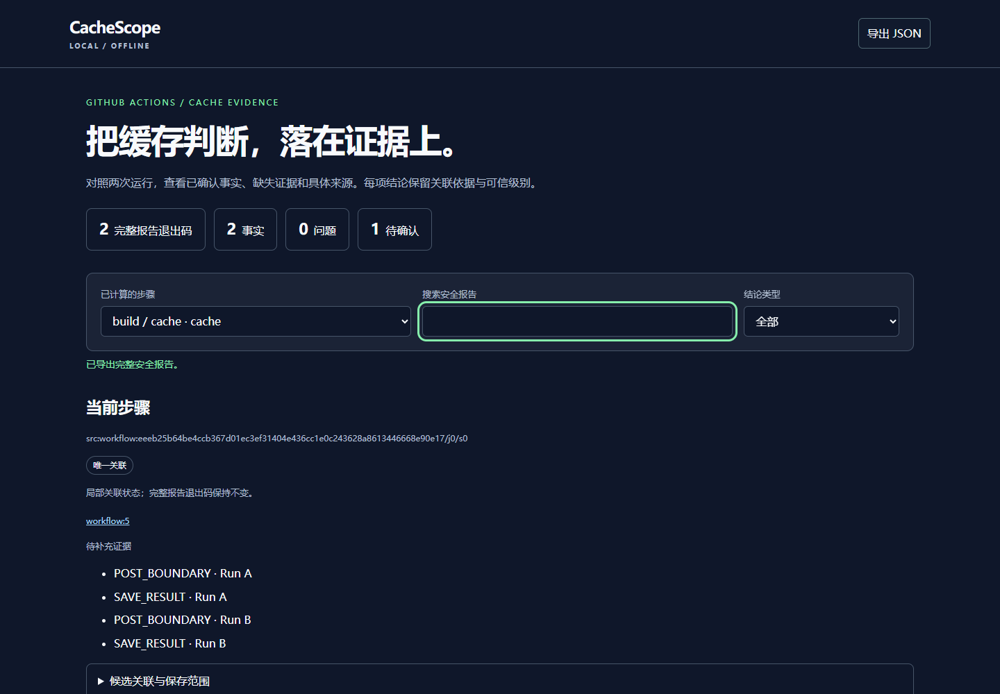

# CacheScope

[English](README.md) · [简体中文](README_ZH.md)

**Local GitHub Actions cache evidence comparison, with a self-contained offline report.**

**本地对照 GitHub Actions 缓存证据，生成可独立打开的离线报告。**

CacheScope compares a workflow with two run logs and optional context/cache-list files. It shows five evidence cards—key, restore keys, OS, resolved paths, and ref—alongside findings, missing evidence, source locations, and copyable YAML suggestions.



## Run from source

Requires Node.js 24.15.0 or newer and npm. Run these commands in the repository:

```sh
npm ci --ignore-scripts
npm run build
node dist/cli.js demo dynamic-key --html report.html --output-json report.json
```

Open `report.html` directly in a browser. The page contains its data, styles and code, uses system fonts, and works offline. Each of the five complete synthetic demos currently exits **2** because independent evidence is still pending; a generated report with exit 2 is a successful analysis with unresolved questions.

```sh
node dist/cli.js demo lockfile-path --json
node dist/cli.js demo path-change --html paths.html
node dist/cli.js demo restore-only --html restore.html
node dist/cli.js demo package-cache --html packages.html
```

`demo` defaults to `dynamic-key`. Demos read the packaged workflow, both logs and context through the same loader and rules as your inputs.

## Analyze your files

```sh
node dist/cli.js --workflow workflow.yml --run-a run-a.txt --run-b run-b.txt --context context.json --html report.html --output-json report.json --json
```

| Option | Behavior |
| --- | --- |
| `--workflow`, `--run-a`, `--run-b` | Required explicit input files. |
| `--context` | JSON declarations that map log ranges to workflow steps and optionally supply evidence. See [context format](docs/context.md). |
| `--cache-list` | GitHub REST `actions_caches` object or `gh` array. Entries retain their scope, version and pagination evidence. |
| `--job`, `--step` | Select a job or a unique step ID. For a step without an ID, copy its full stable `stepRef` from a report. |
| `--locale zh-CN\|en` | Report interface and text summary language; default `zh-CN`. JSON facts remain unchanged. |
| `--html`, `--output-json` | Write an HTML or JSON file; both can be requested together. Parent directories must already exist. Explicit paths outside the working directory are supported. |
| `--json` | Emit exactly one Report JSON object on stdout; failures use `{schemaVersion:1,error:{diagnostics:[...]}}`. |
| `--overwrite` | Replace existing ordinary output files. Input files and their aliases are always protected. |
| `--version`, `--help` | Display version or command help. |

Unknown or repeated options fail with exit 3. `-` is not a file-output alias. Default stdout is a safe summary, with diagnostics on stderr. The output priority is **3 > 2 > 1 > 0**:

| Exit | Meaning |
| --- | --- |
| 0 | Evidence is complete and there is no confirmed problem. |
| 1 | A confirmed problem exists and no higher-priority condition applies. |
| 2 | Missing, unverified, ambiguous or conflicting evidence remains. |
| 3 | Invalid input, a budget limit, or an input/output failure. |

## Read the report

Switch between computed steps, search the safe report and filter findings. Each source link opens the relevant physical line; column ranges and JSON pointers locate the original token. Omitted text is shown as an ellipsis. A zero-width redacted marker is a structural anchor. The page exports the same whole Report JSON and copies static YAML templates with required `REPLACE_WITH_*` placeholders. If clipboard permission is unavailable, a selected text area provides keyboard copying.

Step switching preserves whole-report status. Static workflow expressions are displayed as configuration; actual/log and user-declared observations keep their own origin and verification. Values distinguish missing, explicitly empty, masked and unrecorded. `cache-hit=false` alone does not mean nothing was restored.

## Evidence scope

The bundled [compatibility profile](compatibility.json) contains 12 fixed, source-hashed patterns for selected `actions/cache` v4.0.2 and `actions/setup-node` v4.0.4 statements plus runner download/input-header formats. It records exact source commits and coverage per entry. A declared tag alone is insufficient: the supported runner download statement supplies the commit evidence used to verify a statement's **format semantics**. User-provided log ranges still establish the step mapping. Log authenticity, successful execution and complete save boundaries need separate evidence.

The five demo themes cover dynamic date keys, unresolved lockfile targets, changed paths, restore-only configuration, and package-manager cache objects. Date/key/path/version relationships can be explicitly **user-declared facts**. The lockfile `pathBasis=action-input` means the target came from the action input header, while the error statement supplied the unresolved result. This distinction remains visible. The current profile lacks independent complete-save/failure coverage, so save outcome can remain pending. A complete cache list describes its declared scope and observation time; it does not establish run-time cache availability.

## Privacy and file safety

CacheScope reads only explicit input files and runs locally without network requests, workflow commands or expression evaluation. The loader masks sensitive fields before constructing the report and exports minimum evidence excerpts. Public examples and screenshots use synthetic data. Review reports before sharing them.

Outputs are fully encoded and budget-checked before writing. New files publish exclusively from same-directory exclusive temporary files; overwrite uses same-directory atomic replacement. Input identity/hash, output identities and parent directories are rechecked throughout. Permits are single-use and payload bytes are snapshotted. A later file failure returns `PARTIAL_OUTPUT` / exit 3 and preserves files already written. These are per-file operations; path revalidation and rename are not an operating-system guarantee against every concurrent filesystem change. Unsupported identity or path conditions fail closed.

Input limits: workflow/context/cache-list each 2 MiB, each log 10 MiB, 200,000 total physical lines, 2,000 workflow steps, key length 512 Unicode code points. Additional limits include depth 64, 100 YAML alias references, 100,000 expanded nodes, 50,000 observations, 10,000 cache entries, 20,000 excerpts and 5 MiB excerpt text. JSON is capped at 16 MiB, HTML at 24 MiB and all requested CLI output at 48 MiB.

## Library

```js
import { loadAnalysisInputs, analyzeInputs, renderHtml, exitCode } from 'cachescope';
const loaded = await loadAnalysisInputs({ workflow: 'workflow.yml', runA: 'a.log', runB: 'b.log' });
if (loaded.ok) {
  const analyzed = analyzeInputs(loaded.value.inputs);
  if (analyzed.ok) {
    const html = renderHtml(analyzed.value, 'en'); // Result<string>
    console.log(exitCode(analyzed));
  }
}
```

The public entry exports model types, `loadAnalysisInputs`, `analyzeInputs`, `makeSuggestions`, `exitCode`, and `renderHtml`. Inputs and reports must come from the real loader/analyzer; JSON clones do not acquire trusted identity. The private loader guard and output permits are not serializable. Keep `loaded.value.guard` out of JSON; serialize the analyzed Report. Importing the library starts no analysis or file writes.

## Development and support

```sh
npm test
npm run build
npm run test:browser
npm pack --ignore-scripts
```

The browser test uses Playwright Chromium. Install its browser with `npx playwright install chromium`, or set `CACHESCOPE_BROWSER` to an installed Chrome executable. The local verification used Windows, Node 24.15.0, and Chrome with networking disabled. [Support status](SUPPORT.md) distinguishes executed checks from the proposed CI matrix. See [contribution guidance](CONTRIBUTING.md), [security guidance](SECURITY.md), and [third-party notices](THIRD_PARTY_LICENSES.md).

MIT © cloudwallker.
